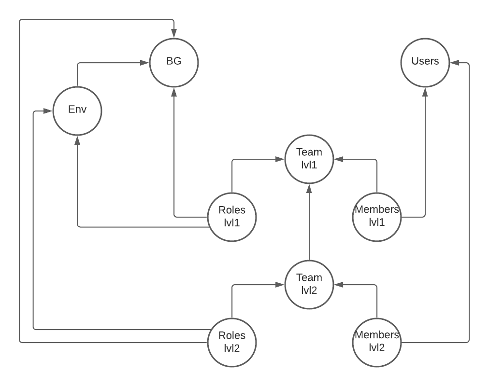

# Bootstrap 3

## Introduction
This templates creates the following resources dynamically by filling the csv files contained in the csv folder:
- Business Groups
- Environments
- Users
- Teams
- Team Roles
- Team Members

## Teams
Teams are created following this structure:


### 1st level teams VS 2nd level teams
* 1st level teams are teams that have root team as parent
* 2nd level teams are teams that have the the first level team as parent

Naturally, 1st level teams are created before 2nd level teams

## How to use the template ? 
Before you begin, make sure you install [terraform](https://learn.hashicorp.com/tutorials/terraform/install-cli).

Copy the template folder to your workspace and perform the following action: 

1. Fill the csv files with your own parameters for each resource type. You can find more information about the parameters for each resource in the `csv file parameters` section.
2. Copy the `template.params.tfvars.json` file content into another json file (we will use `params.tfvars.json` to refer to this copy).
3. Fill the `params.tfvars.json` file with your own parameters. You will find more information about each parameter in the `Terraform parameters file` section
4. To execute the script in order to create parameters, please use the following commands on your terminal:
    * If it's the first time use execute this specific instance of the template, use the following command to initialize terraform providers: 
      ```shell
      $ terraform init  
      ```
    * To apply changes, and create the resources in the platform use the following commands: 
      ```shell
      $ terraform apply -var-file="params.tfvars.json"
      ```
      Terraform will show you all the actions that it is going to perform and will ask for you validation. 
    * To destroy the resources you've previously created, use the following:
      ```shell
      $ terraform destroy -var-file="params.tfvars.json"
      ```

## Resource creation and recycling
When the terraform script is executed, terraform compiles your parameters to know exactly what it is going to create and in which order. Following is a schema that shows the resource that are created. Arrows show dependency relationship. Terraform will start by creating the roots and make its way down through dependencies. 



When Terraform applies changes, the `tfstate` file is updated to save the latest resources state.

When Terraform is executed for update, it will compare against its latest state to refresh and recycle all resources. 

> **N.B:** If the resource have been changed outside terraform (using anypoint UI for example) terraform will not include those changes, and they will be lost.

## Terraform parameters file
The parameters file is used to contextualize terraform's execution. Following is the list of parameters
```json
{
  "username": "xxxxxxxx",                             // anypoint username 
  "password": "xxxxxxxx",                             // anypoint password
  "root_org": "xxxxxxxxx-xxxx-xxxx-xxx-xxxxxxxxxx",   // root business group id
  "root_team": "xxxxxxxxx-xxxx-xxxx-xxx-xxxxxxxxxx",  // root team id
  "cplane": "us",                                     // anypoint control plane
  "sub_org_ids": []                                   // the existing sub organizations that you want to use and link resources to
}
```

The anypoint user should have admin privileges.  

## CSV file parameters
This section describes the CSV columns for each resource

#### Business Groups (BG)
Following is the description of the columns in the `csv/bgs.csv` file:

| Column name   | Description | Example|
| -----------   | ----------- | ------ |
| name          | the name of the bg | My-Awesome-BG |
| owner_username | the bg owner username    | userxxx1 |
| create_suborgs | indicates if the bg has rights to have sub-orgs | true |
| global_deployment | indicates if the bg has the rights for global deployments | true |
| vcores_prod    | indicates the total amount of vcores to allocate for production environments | 0.1 |
| vcores_sandbox | indicates the total amount of vcores to allocate for sandbox environments | 0.5 |
| vcores_design  | indicates the total amount of vcores to allocate for design environments | 0.1 |
| static_ips     | the total number of static ips that can be used by the bg | 0 |
| vpcs           | the number of vpcs that can be used by this bg | 1 | 
| lbs            | the number of load balancers that can be used by this bg | 1 |
| vpns           | the number of vpns that can be used by this this bg | 0 |


#### Environments (ENV)
Following is the description of the columns in the `csv/envs.csv` file:


| Column name   | Description | Example|
| -----------   | ----------- | ------ |
| bg_name       | the bg name to attach to this environment | BG1 |
| name          | the name of the environment | DEV |
| type          | the type of the environment | sandbox | 

#### Users
Following is the description of the columns in the `csv/users.csv` file:

| Column name   | Description | Example|
| -----------   | ----------- | ------ |
| username      | the username of the user, it must be unique and shouldn't be used twice (even if the user has been deleted) | userxx1 |
| firstname     | the user's firstname | john |
| lastname      | the user's lastname  | doe  |
| email         | the usere's email address | my@email.com |
| phone         | the user's phone number   | 0121231232   |
| pwd           | the user's initial password | mysupersecurepwd |


#### Teams (lvl1)
Following is the description of the columns in the `csv/teams_lvl1.csv` file:

| Column name   | Description | Example|
| -----------   | ----------- | ------ |
| name          | the team's name | BG1 team |
| type          | the type of the team, can only have the value internal as of now | internal |

These teams are created under the root team.

#### Team Roles (lvl1)
Following is the description of the columns in the `csv/teams_lvl1_roles.csv` file:

| Column name   | Description | Example|
| -----------   | ----------- | ------ |
| team_name     | the team's name to which the role will be attached | Developers |
| name          | the role's name | API Group Administrator |
| context_org_name | the organization (bg) name to which the role will be applied against | BG1 |
| context_env_name | if the role spans environments, then provide the environment's name to which the role will be applied against | DEV |

#### Team Members (lvl1)
Following is the description of the columns in the `csv/teams_lvl1_members.csv` file:


| Column name   | Description | Example|
| -----------   | ----------- | ------ |
| team_name    | the team's name to which the user will be added to | Testers |
| user_name    | the user's username | user123 |


#### Teams (lvl2)
Following is the description of the columns in the `csv/teams_lvl2.csv` file:

| Column name   | Description | Example|
| -----------   | ----------- | ------ |
| name          | the team's name | BG1 team |
| parent_team_name | the parent team's name | Developers |
| type          | the type of the team, can only have the value internal as of now | internal |


#### Team Roles (lvl2)
Following is the description of the columns in the `csv/teams_lvl2_roles.csv` file:

| Column name   | Description | Example|
| -----------   | ----------- | ------ |
| team_name    | the team's name to which the role will be attached | Consumers |
| name          | the role's name | API Group Administrator |
| context_org_name | the organization (bg) name to which the role will be applied against | BG1 |
| context_env_name | if the role spans environments, then provide the environment's name to which the role will be applied against | INT |


#### Team Members (lvl2)
Following is the description of the columns in the `csv/teams_lvl2_members.csv` file:


| Column name   | Description | Example|
| -----------   | ----------- | ------ |
| team_name    | the team's name to which the user will be added to | Developers |
| user_name    | the user's username | user1343 |


## Template Limits

* When a team is added to `csv/teams_lvl1.csv` or `csv/teams_lvl2.csv` files, at least one role should be attached to it in the corresponding roles file.


